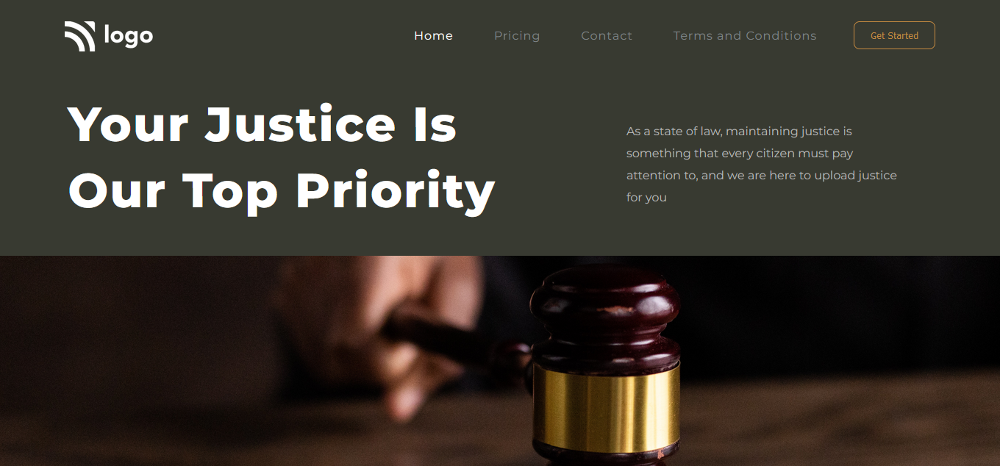

# Law Home Page 

## Project Live Link: [Law Home Page](https://justice-home-page.netlify.app/)

Screenshot

## Learnings from this project

- Got good understanding of positions and how to use them.
- Learned to upload the background image using CSS only.
- Learned to adjust the background image according to the given image using background position and size property.
- Got good understanding of using pseudo classes.

## Time Taken to finish the project

It took me approximately 2.5 hours to complete this project.
